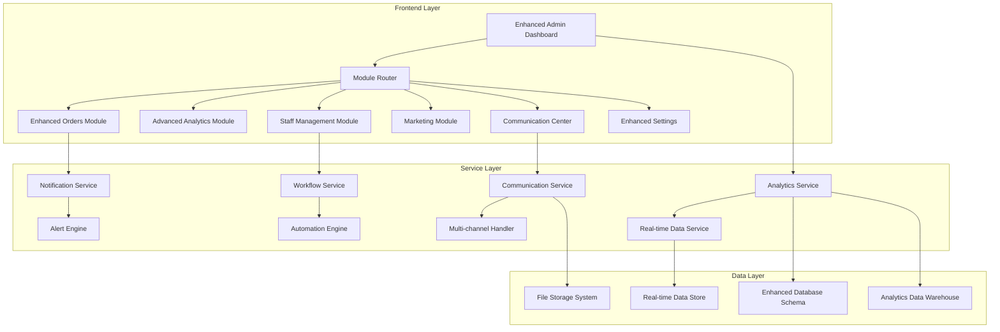

# Admin Panel Enhancements - Design Document

## Overview

This design document outlines the technical architecture and implementation approach for enhancing the SU Curries Admin Panel. The enhancements will transform the current basic admin interface into a comprehensive restaurant operations center with advanced features, real-time analytics, and intelligent automation.

The design follows a modular approach, building upon the existing React/TypeScript architecture while introducing new components, services, and data models to support the enhanced functionality.

## Architecture

### High-Level Architecture



### Component Architecture

The enhanced admin panel will follow a hierarchical component structure:

```
AdminDashboard/
├── EnhancedDashboard/
│   ├── QuickActions/
│   ├── AdvancedAlerts/
│   ├── KPICards/
│   └── SystemHealth/
├── AdvancedAnalytics/
│   ├── ReportBuilder/
│   ├── CustomDashboards/
│   ├── PredictiveAnalytics/
│   └── ExportManager/
├── EnhancedOrders/
│   ├── OrderTimeline/
│   ├── KitchenDisplay/
│   ├── DeliveryOptimization/
│   └── RefundManager/
├── StaffManagement/
│   ├── ScheduleManager/
│   ├── PerformanceTracker/
│   ├── PayrollIntegration/
│   └── TaskAssignment/
├── MarketingCenter/
│   ├── CampaignManager/
│   ├── CouponGenerator/
│   ├── EmailMarketing/
│   └── SocialMediaIntegration/
├── CommunicationCenter/
│   ├── LiveChat/
│   ├── SMSManager/
│   ├── EmailTemplates/
│   └── SupportTickets/
└── EnhancedSettings/
    ├── WorkflowAutomation/
    ├── SecuritySettings/
    ├── IntegrationManager/
    └── ComplianceTools/
```

## Components and Interfaces

### 1. Enhanced Dashboard Component

#### QuickActions Component
```typescript
interface QuickAction {
  id: string;
  title: string;
  icon: React.ComponentType;
  action: () => Promise<void>;
  loading?: boolean;
  disabled?: boolean;
  badge?: number;
}

interface QuickActionsProps {
  actions: QuickAction[];
  onActionClick: (actionId: string) => void;
}
```

#### AdvancedAlerts Component
```typescript
interface Alert {
  id: string;
  type: 'payment_failed' | 'order_delay' | 'feedback' | 'security';
  priority: 'urgent' | 'medium' | 'low';
  title: string;
  message: string;
  timestamp: Date;
  actions?: AlertAction[];
  autoEscalate?: boolean;
  escalationTime?: number;
}

interface AlertAction {
  id: string;
  label: string;
  action: () => Promise<void>;
  variant: 'primary' | 'secondary' | 'danger';
}
```

### 2. Advanced Analytics Module

#### ReportBuilder Component
```typescript
interface ReportConfig {
  id: string;
  name: string;
  type: 'inventory_forecast' | 'customer_ltv' | 'staff_performance' | 'menu_engineering';
  filters: ReportFilter[];
  groupBy: string[];
  metrics: string[];
  dateRange: DateRange;
  visualization: 'table' | 'chart' | 'graph';
}

interface ReportFilter {
  field: string;
  operator: 'equals' | 'contains' | 'greater_than' | 'less_than';
  value: any;
}
```

#### PredictiveAnalytics Component
```typescript
interface PredictionModel {
  type: 'demand_forecast' | 'inventory_optimization' | 'customer_churn';
  accuracy: number;
  lastTrained: Date;
  predictions: Prediction[];
}

interface Prediction {
  date: Date;
  value: number;
  confidence: number;
  factors: string[];
}
```

### 3. Staff Management Module

#### ScheduleManager Component
```typescript
interface Employee {
  id: string;
  name: string;
  role: string;
  hourlyRate: number;
  availability: TimeSlot[];
  skills: string[];
  performanceRating: number;
}

interface Shift {
  id: string;
  employeeId: string;
  date: Date;
  startTime: string;
  endTime: string;
  role: string;
  status: 'scheduled' | 'confirmed' | 'completed' | 'cancelled';
}

interface Schedule {
  weekOf: Date;
  shifts: Shift[];
  totalHours: number;
  laborCost: number;
  coverage: CoverageAnalysis;
}
```

### 4. Marketing & Promotions Module

#### CampaignManager Component
```typescript
interface Campaign {
  id: string;
  name: string;
  type: 'email' | 'sms' | 'social' | 'push';
  status: 'draft' | 'scheduled' | 'active' | 'completed' | 'paused';
  targetAudience: CustomerSegment;
  content: CampaignContent;
  schedule: CampaignSchedule;
  metrics: CampaignMetrics;
}

interface CampaignMetrics {
  sent: number;
  delivered: number;
  opened: number;
  clicked: number;
  converted: number;
  revenue: number;
  roi: number;
}
```

### 5. Communication Center Module

#### LiveChat Component
```typescript
interface ChatSession {
  id: string;
  customerId: string;
  agentId: string;
  status: 'active' | 'waiting' | 'closed';
  messages: ChatMessage[];
  startTime: Date;
  endTime?: Date;
  satisfaction?: number;
}

interface ChatMessage {
  id: string;
  senderId: string;
  senderType: 'customer' | 'agent' | 'system';
  content: string;
  timestamp: Date;
  type: 'text' | 'image' | 'file' | 'system';
}
```

### 6. Workflow Automation System

#### WorkflowEngine Component
```typescript
interface Workflow {
  id: string;
  name: string;
  description: string;
  trigger: WorkflowTrigger;
  conditions: WorkflowCondition[];
  actions: WorkflowAction[];
  status: 'active' | 'inactive' | 'error';
  lastRun?: Date;
  nextRun?: Date;
}

interface WorkflowTrigger {
  type: 'schedule' | 'event' | 'condition';
  config: any;
}

interface WorkflowAction {
  type: 'send_email' | 'update_status' | 'create_task' | 'send_notification';
  config: any;
  delay?: number;
}
```

## Data Models

### Enhanced Database Schema

#### New Tables

```sql
-- Staff Management
CREATE TABLE employees (
  id UUID PRIMARY KEY,
  user_id UUID REFERENCES users(id),
  employee_number VARCHAR(20) UNIQUE,
  hire_date DATE,
  role VARCHAR(50),
  department VARCHAR(50),
  hourly_rate DECIMAL(10,2),
  status VARCHAR(20) DEFAULT 'active',
  created_at TIMESTAMP DEFAULT NOW(),
  updated_at TIMESTAMP DEFAULT NOW()
);

CREATE TABLE shifts (
  id UUID PRIMARY KEY,
  employee_id UUID REFERENCES employees(id),
  date DATE,
  start_time TIME,
  end_time TIME,
  break_duration INTEGER DEFAULT 0,
  status VARCHAR(20) DEFAULT 'scheduled',
  actual_start_time TIME,
  actual_end_time TIME,
  created_at TIMESTAMP DEFAULT NOW()
);

-- Marketing & Campaigns
CREATE TABLE campaigns (
  id UUID PRIMARY KEY,
  name VARCHAR(255),
  type VARCHAR(50),
  status VARCHAR(20) DEFAULT 'draft',
  target_audience JSONB,
  content JSONB,
  schedule JSONB,
  metrics JSONB DEFAULT '{}',
  created_by UUID REFERENCES users(id),
  created_at TIMESTAMP DEFAULT NOW(),
  updated_at TIMESTAMP DEFAULT NOW()
);

-- Communication & Support
CREATE TABLE chat_sessions (
  id UUID PRIMARY KEY,
  customer_id UUID REFERENCES users(id),
  agent_id UUID REFERENCES users(id),
  status VARCHAR(20) DEFAULT 'active',
  start_time TIMESTAMP DEFAULT NOW(),
  end_time TIMESTAMP,
  satisfaction_rating INTEGER,
  tags TEXT[]
);

CREATE TABLE chat_messages (
  id UUID PRIMARY KEY,
  session_id UUID REFERENCES chat_sessions(id),
  sender_id UUID REFERENCES users(id),
  sender_type VARCHAR(20),
  content TEXT,
  message_type VARCHAR(20) DEFAULT 'text',
  timestamp TIMESTAMP DEFAULT NOW()
);

-- Workflow Automation
CREATE TABLE workflows (
  id UUID PRIMARY KEY,
  name VARCHAR(255),
  description TEXT,
  trigger_config JSONB,
  conditions JSONB DEFAULT '[]',
  actions JSONB DEFAULT '[]',
  status VARCHAR(20) DEFAULT 'active',
  last_run TIMESTAMP,
  next_run TIMESTAMP,
  created_at TIMESTAMP DEFAULT NOW()
);

-- Analytics & Reports
CREATE TABLE custom_reports (
  id UUID PRIMARY KEY,
  name VARCHAR(255),
  type VARCHAR(50),
  config JSONB,
  schedule JSONB,
  created_by UUID REFERENCES users(id),
  created_at TIMESTAMP DEFAULT NOW()
);

-- Enhanced Inventory
CREATE TABLE recipes (
  id UUID PRIMARY KEY,
  product_id UUID REFERENCES products(id),
  name VARCHAR(255),
  instructions TEXT,
  prep_time INTEGER,
  cook_time INTEGER,
  servings INTEGER,
  cost_per_serving DECIMAL(10,2),
  created_at TIMESTAMP DEFAULT NOW()
);

CREATE TABLE recipe_ingredients (
  id UUID PRIMARY KEY,
  recipe_id UUID REFERENCES recipes(id),
  ingredient_name VARCHAR(255),
  quantity DECIMAL(10,3),
  unit VARCHAR(50),
  cost DECIMAL(10,2),
  supplier_id UUID
);

-- Supplier Management
CREATE TABLE suppliers (
  id UUID PRIMARY KEY,
  name VARCHAR(255),
  contact_person VARCHAR(255),
  email VARCHAR(255),
  phone VARCHAR(50),
  address JSONB,
  rating DECIMAL(3,2),
  payment_terms VARCHAR(100),
  created_at TIMESTAMP DEFAULT NOW()
);
```

### Enhanced Existing Tables

```sql
-- Add columns to existing orders table
ALTER TABLE orders ADD COLUMN kitchen_notes TEXT;
ALTER TABLE orders ADD COLUMN estimated_prep_time INTEGER;
ALTER TABLE orders ADD COLUMN actual_prep_time INTEGER;
ALTER TABLE orders ADD COLUMN delivery_route JSONB;
ALTER TABLE orders ADD COLUMN customer_rating INTEGER;
ALTER TABLE orders ADD COLUMN feedback TEXT;

-- Add columns to existing users table
ALTER TABLE users ADD COLUMN customer_segment VARCHAR(50) DEFAULT 'regular';
ALTER TABLE users ADD COLUMN loyalty_points INTEGER DEFAULT 0;
ALTER TABLE users ADD COLUMN lifetime_value DECIMAL(10,2) DEFAULT 0;
ALTER TABLE users ADD COLUMN last_order_date TIMESTAMP;
ALTER TABLE users ADD COLUMN communication_preferences JSONB DEFAULT '{}';

-- Add columns to existing products table
ALTER TABLE products ADD COLUMN recipe_id UUID REFERENCES recipes(id);
ALTER TABLE products ADD COLUMN profit_margin DECIMAL(5,2);
ALTER TABLE products ADD COLUMN popularity_score DECIMAL(5,2);
ALTER TABLE products ADD COLUMN seasonal_availability JSONB;
```

## Error Handling

### Centralized Error Management

```typescript
interface AdminError {
  code: string;
  message: string;
  severity: 'low' | 'medium' | 'high' | 'critical';
  module: string;
  timestamp: Date;
  userId?: string;
  context?: any;
}

class AdminErrorHandler {
  static handle(error: AdminError): void {
    // Log error
    this.logError(error);
    
    // Send to monitoring service
    this.sendToMonitoring(error);
    
    // Notify relevant users if critical
    if (error.severity === 'critical') {
      this.notifyAdmins(error);
    }
    
    // Show user-friendly message
    this.showUserMessage(error);
  }
}
```

### Module-Specific Error Handling

Each module will implement specific error handling:

- **Analytics Module**: Handle data processing errors, report generation failures
- **Staff Module**: Handle scheduling conflicts, payroll calculation errors
- **Marketing Module**: Handle campaign delivery failures, template errors
- **Communication Module**: Handle message delivery failures, chat connection issues

## Testing Strategy

### Unit Testing
- Component testing with React Testing Library
- Service layer testing with Jest
- Utility function testing
- Error handling testing

### Integration Testing
- API integration testing
- Database operation testing
- Third-party service integration testing
- Workflow automation testing

### End-to-End Testing
- Complete user workflows
- Cross-module functionality
- Performance testing under load
- Security testing

### Performance Testing
- Load testing for concurrent admin users
- Database query optimization testing
- Real-time feature performance testing
- Mobile admin interface testing

## Security Considerations

### Authentication & Authorization
- Enhanced role-based access control (RBAC)
- Module-specific permissions
- Action-level authorization
- Session management improvements

### Data Protection
- Sensitive data encryption
- Audit trail for all admin actions
- Data anonymization for analytics
- GDPR compliance features

### API Security
- Rate limiting for admin endpoints
- Input validation and sanitization
- SQL injection prevention
- XSS protection

## Performance Optimization

### Frontend Optimization
- Code splitting for each module
- Lazy loading of heavy components
- Memoization of expensive calculations
- Virtual scrolling for large datasets

### Backend Optimization
- Database query optimization
- Caching strategies for frequently accessed data
- Background job processing for heavy operations
- Real-time data streaming optimization

### Real-time Features
- WebSocket connections for live updates
- Efficient data synchronization
- Optimistic UI updates
- Connection resilience

## Mobile Considerations

### Responsive Design
- Mobile-first approach for admin interface
- Touch-friendly interactions
- Optimized layouts for small screens
- Gesture support implementation

### Mobile-Specific Features
- Push notifications
- Offline functionality
- Voice input support
- Camera integration for barcode scanning

### Performance on Mobile
- Reduced bundle sizes
- Optimized images and assets
- Efficient data loading
- Battery usage optimization

## Implementation Phases

### Phase 1: Foundation (Weeks 1-2)
- Enhanced dashboard with quick actions
- Advanced alert system
- Basic analytics improvements
- Database schema updates

### Phase 2: Core Modules (Weeks 3-5)
- Staff management module
- Enhanced orders management
- Marketing & promotions module
- Communication center basics

### Phase 3: Advanced Features (Weeks 6-8)
- Workflow automation system
- Advanced analytics and reporting
- Business intelligence features
- Mobile optimization

### Phase 4: Integration & Polish (Weeks 9-10)
- Third-party integrations
- Performance optimization
- Security enhancements
- Comprehensive testing

This design provides a solid foundation for implementing the enhanced admin panel while maintaining scalability, security, and user experience standards.