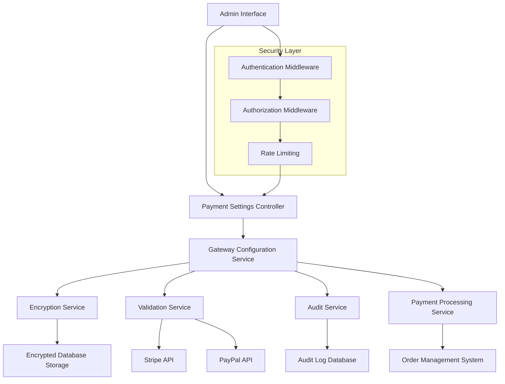
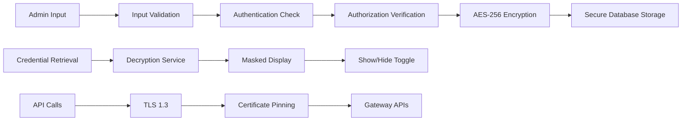

# Payment Gateway Settings - Design Document

## Overview

The Payment Gateway Settings system provides a secure, user-friendly interface for restaurant administrators to configure and manage payment processing capabilities. The design emphasizes security-first architecture with encrypted credential storage, real-time validation, and seamless integration with existing order processing systems.

## Architecture

### High-Level Architecture



### Security Architecture



## Components and Interfaces

### 1. Payment Settings Page Component

**Location:** `frontend/src/pages/admin/PaymentSettingsPage.tsx`

**Props Interface:**
```typescript
interface PaymentSettingsPageProps {
  onSettingsUpdate?: (settings: PaymentSettings) => void;
  initialSettings?: PaymentSettings;
}
```

**Key Features:**
- Tabbed interface for different payment gateways
- Real-time connection status indicators
- Secure credential input fields with show/hide functionality
- Environment switching (Test/Live)
- Bulk configuration import/export

### 2. Gateway Configuration Component

**Location:** `frontend/src/components/admin/GatewayConfiguration.tsx`

**Props Interface:**
```typescript
interface GatewayConfigurationProps {
  gateway: 'stripe' | 'paypal';
  configuration: GatewayConfig;
  onConfigurationChange: (config: GatewayConfig) => void;
  onTestConnection: () => Promise<ConnectionTestResult>;
  isEnabled: boolean;
  environment: 'test' | 'live';
}
```

**Features:**
- Gateway-specific configuration forms
- Connection testing with real-time feedback
- Credential masking and reveal functionality
- Environment-specific settings management

### 3. Secure Input Component

**Location:** `frontend/src/components/admin/SecureInput.tsx`

**Props Interface:**
```typescript
interface SecureInputProps {
  label: string;
  value: string;
  onChange: (value: string) => void;
  type: 'text' | 'password' | 'api-key';
  masked?: boolean;
  showToggle?: boolean;
  validation?: (value: string) => ValidationResult;
  placeholder?: string;
  helpText?: string;
}
```

### 4. Connection Status Indicator

**Location:** `frontend/src/components/admin/ConnectionStatus.tsx`

**Props Interface:**
```typescript
interface ConnectionStatusProps {
  status: 'connected' | 'disconnected' | 'testing' | 'error';
  lastTested?: Date;
  errorMessage?: string;
  onRetest?: () => void;
}
```

## Data Models

### Payment Gateway Configuration

```typescript
interface PaymentSettings {
  id: string;
  restaurantId: string;
  stripe: StripeConfiguration;
  paypal: PayPalConfiguration;
  defaultGateway: 'stripe' | 'paypal';
  fallbackEnabled: boolean;
  createdAt: Date;
  updatedAt: Date;
  lastModifiedBy: string;
}

interface StripeConfiguration {
  enabled: boolean;
  environment: 'test' | 'live';
  publishableKey: string; // Encrypted in database
  secretKey: string; // Encrypted in database
  webhookSecret: string; // Encrypted in database
  webhookEndpoint: string;
  connectionStatus: ConnectionStatus;
  lastTested: Date;
  testResults: TestResult[];
}

interface PayPalConfiguration {
  enabled: boolean;
  environment: 'sandbox' | 'live';
  clientId: string; // Encrypted in database
  clientSecret: string; // Encrypted in database
  webhookId: string; // Encrypted in database
  webhookEndpoint: string;
  connectionStatus: ConnectionStatus;
  lastTested: Date;
  testResults: TestResult[];
}

interface ConnectionStatus {
  status: 'connected' | 'disconnected' | 'error';
  message?: string;
  lastChecked: Date;
  responseTime?: number;
}

interface TestResult {
  timestamp: Date;
  success: boolean;
  responseTime: number;
  errorMessage?: string;
  testType: 'connection' | 'webhook' | 'transaction';
}
```

### Audit Log Model

```typescript
interface PaymentAuditLog {
  id: string;
  userId: string;
  action: 'create' | 'update' | 'delete' | 'view' | 'test';
  resource: 'stripe_config' | 'paypal_config' | 'payment_settings';
  changes: Record<string, any>;
  ipAddress: string;
  userAgent: string;
  timestamp: Date;
  success: boolean;
  errorMessage?: string;
}
```

## Services Architecture

### 1. Payment Configuration Service

**Location:** `frontend/src/services/paymentConfiguration.service.ts`

**Key Methods:**
```typescript
class PaymentConfigurationService {
  async getPaymentSettings(): Promise<PaymentSettings>;
  async updatePaymentSettings(settings: PaymentSettings): Promise<boolean>;
  async testGatewayConnection(gateway: string, config: any): Promise<ConnectionTestResult>;
  async validateCredentials(gateway: string, credentials: any): Promise<ValidationResult>;
  async exportConfiguration(): Promise<ConfigurationExport>;
  async importConfiguration(config: ConfigurationExport): Promise<boolean>;
}
```

### 2. Encryption Service

**Location:** `frontend/src/services/encryption.service.ts`

**Key Methods:**
```typescript
class EncryptionService {
  async encryptCredential(value: string): Promise<string>;
  async decryptCredential(encryptedValue: string): Promise<string>;
  async hashForAudit(value: string): Promise<string>;
  maskCredential(value: string, visibleChars: number): string;
}
```

### 3. Gateway Validation Service

**Location:** `frontend/src/services/gatewayValidation.service.ts`

**Key Methods:**
```typescript
class GatewayValidationService {
  async validateStripeCredentials(config: StripeConfiguration): Promise<ValidationResult>;
  async validatePayPalCredentials(config: PayPalConfiguration): Promise<ValidationResult>;
  async testWebhookEndpoint(url: string): Promise<WebhookTestResult>;
  async performHealthCheck(gateway: string): Promise<HealthCheckResult>;
}
```

## Error Handling

### Error Types and Responses

```typescript
enum PaymentConfigurationError {
  INVALID_CREDENTIALS = 'INVALID_CREDENTIALS',
  CONNECTION_FAILED = 'CONNECTION_FAILED',
  ENCRYPTION_ERROR = 'ENCRYPTION_ERROR',
  UNAUTHORIZED_ACCESS = 'UNAUTHORIZED_ACCESS',
  VALIDATION_FAILED = 'VALIDATION_FAILED',
  WEBHOOK_REGISTRATION_FAILED = 'WEBHOOK_REGISTRATION_FAILED'
}

interface ErrorResponse {
  error: PaymentConfigurationError;
  message: string;
  details?: Record<string, any>;
  suggestions?: string[];
  retryable: boolean;
}
```

### Error Handling Strategy

1. **Client-Side Validation:** Immediate feedback for format errors
2. **Server-Side Validation:** Comprehensive credential and API validation
3. **Graceful Degradation:** Fallback to secondary gateways on failure
4. **User-Friendly Messages:** Clear, actionable error descriptions
5. **Retry Mechanisms:** Automatic retry for transient failures
6. **Logging:** Comprehensive error logging for debugging

## Security Implementation

### 1. Credential Encryption

```typescript
// AES-256-GCM encryption for sensitive data
interface EncryptionConfig {
  algorithm: 'aes-256-gcm';
  keyDerivation: 'pbkdf2';
  iterations: 100000;
  saltLength: 32;
  ivLength: 16;
  tagLength: 16;
}
```

### 2. Access Control

```typescript
interface SecurityPolicy {
  requiredRole: 'admin' | 'super_admin';
  sessionTimeout: number; // 30 minutes
  maxFailedAttempts: number; // 3
  lockoutDuration: number; // 15 minutes
  auditAllAccess: boolean; // true
  requireMFA: boolean; // true for production
}
```

### 3. API Security

- **HTTPS Only:** All communication encrypted with TLS 1.3
- **Certificate Pinning:** Prevent man-in-the-middle attacks
- **Rate Limiting:** Prevent brute force attacks
- **CSRF Protection:** Token-based request validation
- **Input Sanitization:** Comprehensive input validation

## Testing Strategy

### 1. Unit Tests

**Coverage Requirements:** 95% for security-critical components

**Key Test Areas:**
- Encryption/decryption functionality
- Input validation and sanitization
- Error handling and edge cases
- Gateway API integration
- Audit logging accuracy

### 2. Integration Tests

**Test Scenarios:**
- End-to-end configuration workflow
- Gateway failover mechanisms
- Real-time status updates
- Webhook handling
- Multi-user concurrent access

### 3. Security Tests

**Security Test Areas:**
- Credential storage and retrieval
- Access control enforcement
- Audit trail integrity
- Input validation bypass attempts
- Session management security

### 4. Performance Tests

**Performance Metrics:**
- Configuration save/load times < 2 seconds
- Connection testing < 5 seconds
- Concurrent user support (10+ admins)
- Database query optimization
- Memory usage monitoring

## User Interface Design

### 1. Layout Structure

```
┌─────────────────────────────────────────────────────────┐
│ Admin Panel Header                                      │
├─────────────────────────────────────────────────────────┤
│ Settings Navigation                                     │
│ ├── General Settings                                    │
│ ├── User Management                                     │
│ ├── 💳 Payment Gateway Settings ← Active               │
│ └── System Configuration                               │
├─────────────────────────────────────────────────────────┤
│ Payment Gateway Configuration                           │
│                                                         │
│ ┌─────────────┬─────────────┐                          │
│ │   Stripe    │   PayPal    │ ← Tabs                   │
│ └─────────────┴─────────────┘                          │
│                                                         │
│ ┌─ Stripe Configuration ─────────────────────────────┐  │
│ │ [✓] Enable Stripe Payments                         │  │
│ │                                                    │  │
│ │ Environment: [Test ▼] [● Connected]                │  │
│ │                                                    │  │
│ │ Publishable Key: pk_test_****1234 [👁️ Show]       │  │
│ │ Secret Key:      sk_test_****5678 [👁️ Show]       │  │
│ │ Webhook Secret:  whsec_****9012 [👁️ Show]         │  │
│ │                                                    │  │
│ │ [Test Connection] [Save Configuration]             │  │
│ └────────────────────────────────────────────────────┘  │
│                                                         │
│ Recent Activity:                                        │
│ • Configuration updated by admin@restaurant.com        │
│ • Connection test successful - 2 minutes ago           │
│ • Webhook endpoint verified - 5 minutes ago            │
└─────────────────────────────────────────────────────────┘
```

### 2. Responsive Design

- **Desktop:** Full-width configuration panels with side-by-side gateway tabs
- **Tablet:** Stacked configuration sections with collapsible panels
- **Mobile:** Single-column layout with accordion-style sections

### 3. Accessibility Features

- **Screen Reader Support:** Comprehensive ARIA labels and descriptions
- **Keyboard Navigation:** Full keyboard accessibility with logical tab order
- **High Contrast:** Support for high contrast mode
- **Focus Indicators:** Clear visual focus indicators for all interactive elements
- **Error Announcements:** Screen reader announcements for validation errors

## Integration Points

### 1. Order Processing Integration

```typescript
interface PaymentProcessingIntegration {
  getActiveGateways(): Promise<ActiveGateway[]>;
  processPayment(order: Order, gateway: string): Promise<PaymentResult>;
  handleWebhook(gateway: string, payload: any): Promise<WebhookResponse>;
  getGatewayStatus(gateway: string): Promise<GatewayStatus>;
}
```

### 2. Webhook Management

```typescript
interface WebhookManager {
  registerWebhook(gateway: string, endpoint: string): Promise<boolean>;
  updateWebhook(gateway: string, endpoint: string): Promise<boolean>;
  validateWebhookSignature(gateway: string, payload: any, signature: string): boolean;
  processWebhookEvent(gateway: string, event: WebhookEvent): Promise<void>;
}
```

### 3. Audit Integration

```typescript
interface AuditIntegration {
  logConfigurationChange(change: ConfigurationChange): Promise<void>;
  logCredentialAccess(access: CredentialAccess): Promise<void>;
  generateComplianceReport(dateRange: DateRange): Promise<ComplianceReport>;
  exportAuditLogs(filters: AuditFilters): Promise<AuditExport>;
}
```

## Deployment Considerations

### 1. Environment Configuration

```typescript
interface DeploymentConfig {
  encryption: {
    keyRotationInterval: number; // 90 days
    backupKeyCount: number; // 3
    keyStorageLocation: 'env' | 'vault' | 'kms';
  };
  security: {
    sessionTimeout: number; // 1800 seconds
    maxConcurrentSessions: number; // 5
    auditRetentionDays: number; // 2555 (7 years)
  };
  performance: {
    connectionPoolSize: number; // 10
    cacheTimeout: number; // 300 seconds
    rateLimitRequests: number; // 100 per minute
  };
}
```

### 2. Database Migration Strategy

```sql
-- Encrypted credential storage
CREATE TABLE payment_configurations (
    id UUID PRIMARY KEY,
    restaurant_id UUID NOT NULL,
    gateway_type VARCHAR(20) NOT NULL,
    environment VARCHAR(10) NOT NULL,
    encrypted_credentials TEXT NOT NULL,
    encryption_key_id VARCHAR(50) NOT NULL,
    webhook_endpoint VARCHAR(255),
    is_enabled BOOLEAN DEFAULT false,
    connection_status VARCHAR(20) DEFAULT 'disconnected',
    last_tested TIMESTAMP,
    created_at TIMESTAMP DEFAULT NOW(),
    updated_at TIMESTAMP DEFAULT NOW(),
    created_by UUID NOT NULL
);

-- Audit trail
CREATE TABLE payment_audit_logs (
    id UUID PRIMARY KEY,
    user_id UUID NOT NULL,
    action VARCHAR(20) NOT NULL,
    resource VARCHAR(50) NOT NULL,
    resource_id UUID,
    changes JSONB,
    ip_address INET,
    user_agent TEXT,
    timestamp TIMESTAMP DEFAULT NOW(),
    success BOOLEAN NOT NULL
);
```

### 3. Monitoring and Alerting

```typescript
interface MonitoringConfig {
  healthChecks: {
    interval: number; // 300 seconds
    timeout: number; // 10 seconds
    retryCount: number; // 3
  };
  alerts: {
    connectionFailure: boolean;
    configurationChanges: boolean;
    suspiciousActivity: boolean;
    performanceDegradation: boolean;
  };
  metrics: {
    responseTime: boolean;
    errorRate: boolean;
    throughput: boolean;
    securityEvents: boolean;
  };
}
```

This comprehensive design provides a secure, scalable, and user-friendly payment gateway configuration system that integrates seamlessly with your existing SU Curries application architecture.